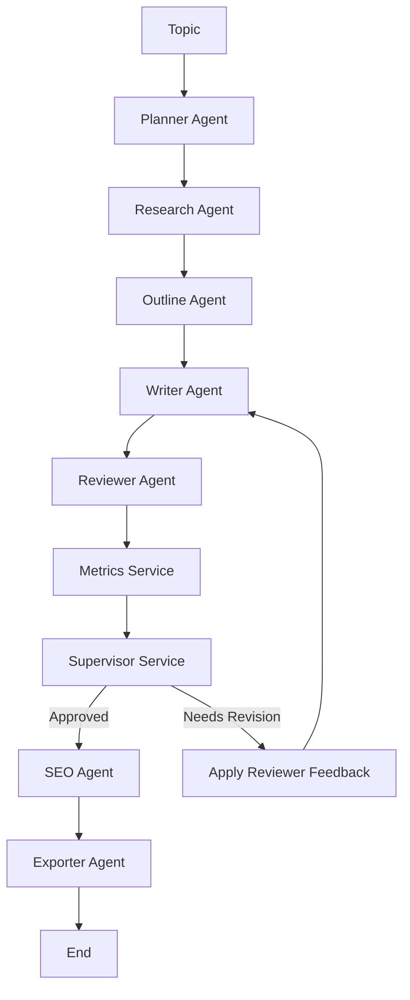

# ai-multi-agent-documentation-writer

A Node.js project that uses **gemini-2.5-flash/ gemini-3.5-flash** to generate technical documentation through a multi-agent workflow. Instead of asking one model to write an entire documentation, the work is divided into specialized agents. Each agent focuses on a single responsibility, making the output easier to review, improve, and maintain.

---

## Workflow




---

## Components

| Component          | Responsibility                                                                                           |
| ------------------ | -------------------------------------------------------------------------------------------------------- |
| Planner            | Creates the documentation strategy based on the given topic.                                                   |
| Research           | Collects technical concepts, best practices, and implementation details.                                 |
| Outline            | Organizes the research into a structured documentation outline.                                                |
| Writer             | Generates the documentation or improves an existing draft using reviewer feedback.                             |
| Reviewer           | Reviews the documentation, assigns quality scores, and provides improvement suggestions.                       |
| Metrics Service    | Calculates objective metrics like readability, SEO, formatting, and word count.                          |
| Supervisor Service | Combines the review scores and metrics to decide whether the documentation is ready or needs another revision. |
| SEO                | Generates SEO metadata for the final documentation.                                                            |
| Exporter           | Saves the documentation and SEO metadata to the `output` directory.                                            |

---

## Example

For a topic like **"React JS Performance Optimization"**, the Writer generates the first draft, the Reviewer evaluates it and suggests improvements, the Metrics Service calculates objective scores, and the Supervisor decides whether the documentation is good enough to continue or should go back to the Writer for another revision. This loop continues until the quality threshold is met or the maximum revision limit is reached.


---

## Features

* Multi-Agent Architecture
* Automated Review Loop
* AI + Rule-Based Evaluation
* Markdown documentation Generation
* SEO Metadata Generation
* Local File Export

---

## Tech Stack

* Node.js
* JavaScript (ES Modules)
* Google AI

---

## Run

```bash
npm install
npm start
```
